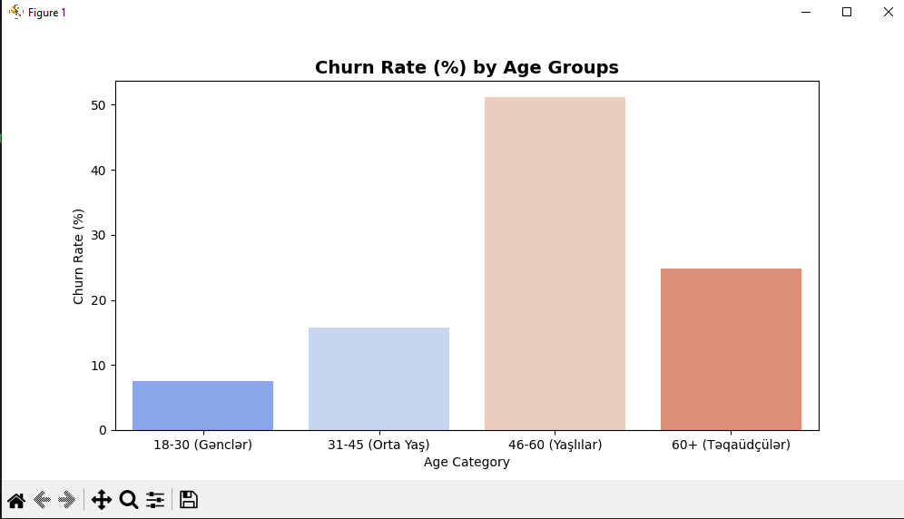
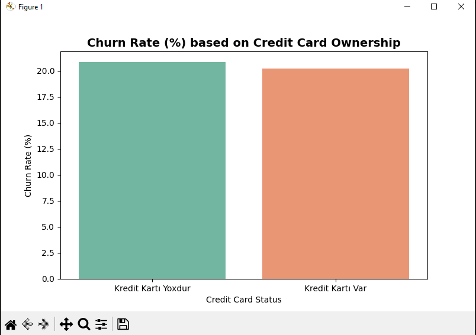

# 📊 Bank Müştərilərinin Tərk Etməsi (Churn) Analizi || Bank Customer Churn & Risk Analysis

An End-to-End Data Analytics Project using SQL and Python.
SQL və Python alətlərindən istifadə edilməklə hazırlanmış ucdan-uca data analitikası layihəsi.

## 🇬🇧 Project Overview
This project identifies why bank customers are leaving (churning) using a dataset of 10,000 customers. The analysis focuses on demographic, financial, and product-related risks using SQL and Python to provide actionable insights for customer retention strategies.

---

## 🛠️ İstifadə Olunan Alətlər
* **SQL:** Məlumatların qruplaşdırılması və əsas metriklərin hesablanması (`customer_churn_queries.sql`).
* **Python (Pandas, Seaborn, Matplotlib):** Data manipulyasiyası, yaş qruplaşdırılması və vizuallaşdırma (`churn_analysis.ipynb`).

---

## 💻 Əsas Kodlar, İzahlar və Qrafiklər

### 1. Müştərinin Sahib Olduğu Məhsul Sayı (SQL)
Müştərinin bankdan aldığı məhsul sayının onun getmə riskinə təsirini ölçən SQL sorğusu:

SELECT 
    NumOfProducts AS Mehsul_Sayi,
    COUNT(*) AS Toplam_Musteri,
    SUM(Exited) AS Terk_Eden_Musteri,
    CAST((SUM(Exited) * 100.0 / COUNT(*)) AS DECIMAL(10,2)) AS Churn_Faizi
FROM BankCustomers
GROUP BY NumOfProducts
ORDER BY Churn_Faizi DESC;
---

## 🌍 Language Selection / Dil Seçimi
* [📊 English Version](#english-version)
* [📊 Azərbaycan Dilində Versiya](#azerbaycan-dilinde-versiya)

---

## Azerbaycan Dilinde Versiya

### 🛠️ İstifadə Olunan Alətlər
* **SQL:** Bütün sorğular `customer_churn_queries.sql` faylı daxilində yerləşir.
* **Python:** Tam analitik kodlar `churn_analysis.ipynb` faylı daxilində yerləşir.

---

## English Version

### 🛠️ Tech Stack & Tools Used
* **SQL:** Comprehensive queries are stored in `customer_churn_queries.sql`
* **Python:** Full exploratory data analysis (EDA) code is available in `churn_analysis.ipynb`

---

Qrafikin Mənası (Rənglər): Bu qrafik faktorların bir-biri ilə riyazi əlaqəsini göstərir.
Qırmızı rənglər müsbət (birlikdə artan), göy rənglər isə mənfi (biri artanda digəri azalan) əlaqəni bildirir.
$0.00$ isə tamamilə təsirsiz deməkdir.Ən Böyük Təhlükə — Yaş (Age ➡️ $+0.29$): Müştəri itkisi (Exited) ilə ən güclü müsbət əlaqə yaşdadır.
Yəni müştərinin yaşı artdıqca, bankı tərk etmə riski də düz mütənasib olaraq artır.
Ən Yaxşı Həll — Aktivlik (IsActiveMember ➡️ $-0.16$): İtki ilə ən güclü mənfi (tərs) əlaqə buradadır.
Yəni, müştəri sistemdə neçə çox aktiv olarsa, bankdan getmə riski bir o qədər azalır.
Təsirsiz Faktor — Kredit Kartı (HasCrCard ➡️ $-0.01$): Rəqəm sıfıra bərabərdir.
Deməli, müştəriyə kredit kartı vermək onun bankda qalıb-qalmamasına heç bir təsir etmir.

### 📈 Key Insights & Business Findings

Qrafikin Biznes İzahı:
Bu qrafik bankın demoqrafik zəifliyini ortaya qoyur. 46-60 yaş arası (Yaşlılar) qrupunda itki faizi 50%-dən çoxdur.
Yəni bankdakı hər iki yaşlı müştəridən biri hesabı bağlayıb gedir.
Ən sadiq qrup isə gənclərdir (18-30 yaş). Bank yaşlı nəsil üçün rəqəmsal əlçatanlığı və depozit şərtlərini yaxşılaşdırmalıdır.

---

Qrafikin Biznes İzahı:
Bu istilik xəritəsi (Heatmap) bizə hansı faktorun müştərinin getməsinə birbaşa təsir etdiyini göstərir.
Müştəri itkisi (Exited) ilə ən güclü müsbət əlaqə Yaş (+0.29) amilindədir.
Ən güclü mənfi əlaqə isə Aktiv Üzvlük (-0.16) göstəricisindədir. 
Yəni müştərini sistemdə aktiv saxlamaq onun qaçma riskini birbaşa azaldır.

### 📈 Əsas Çıxarılan Qərarlar (Insights)

#### 1. Məhsul Strategiyası Fəsadları
Müştərinin **2 məhsulu olduqda itki minimumdur (7.60% Churn)**. 3 və ya 4 məhsul satıldıqda isə itki dərhal **82%-100%-ə dırmaşır**.

#### 2. Riyazi Əlaqələr və Kredit Kartının Təsirsizliyi
Yaş ilə Churn arasında güclü müsbət əlaqə var (**+0.29**). Kredit kartı sahibliyi isə **-0.01** çıxmışdır, yani kartın olub-olmaması müştərinin sadiqliyinə riyazi təsir göstərmir.

#### 3.
Məhsul Sayı Riski: Bankda 2 məhsulu olan müştərilər ən sadiq müştərilərdir (cəmi 7.60% itki). Lakin müştəriyə 3 və ya 4 məhsul satıldıqda,
narazılıq yaranır və müştərilərin demək olar ki, hamısı (82% - 100%-i) bankı tərk edir.

#### 4.
Yaşlı Nəslin İtirilməsi: 46-60 yaş arası (Yaşlılar) müştəri qrupunda tərk etmə faizi çox yüksəkdir — 50%-dən çox.
Hər iki yaşlı müştəridən biri bankdan gedir. Bu sahədə yaşlılar üçün xüsusi xidmət və ya proqramlara ehtiyac var.

